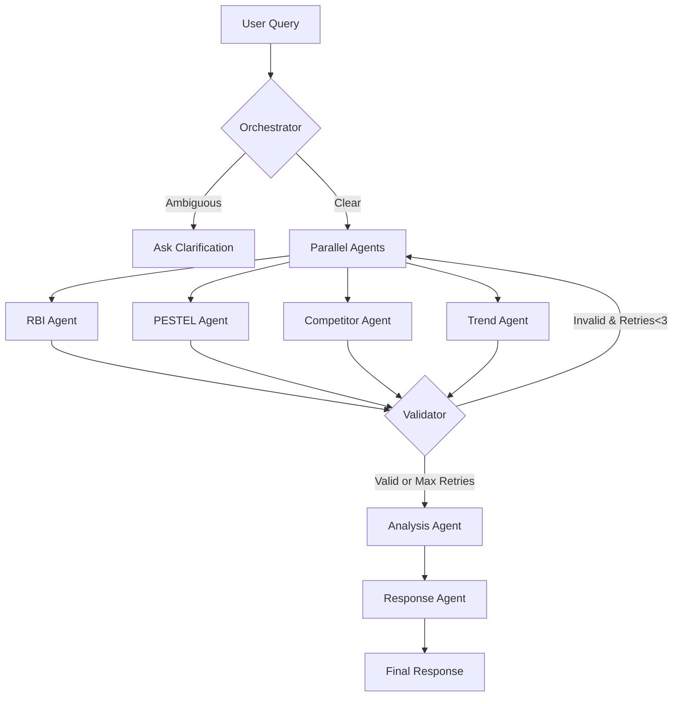

# 🚀 CompliSense Developer Guide

## Quick Start

This guide helps developers understand, modify, and extend the CompliSense multi-agent AI system.

---

## 📁 Project Structure

```
CompliSense/
├── src/
│   ├── __init__.py                 # Package initialization
│   ├── config.py                   # Centralized configuration
│   ├── state.py                    # Workflow state schema
│   ├── agents/                     # Agent implementations
│   │   ├── __init__.py            # Agent exports
│   │   ├── orchestrator_agent.py  # Query understanding
│   │   ├── rbig_agent.py          # RBI compliance (RAG)
│   │   ├── pestel_agent.py        # PESTEL analysis
│   │   ├── competitor_agent.py    # Competitor analysis
│   │   ├── trend_agent.py         # Trend prediction
│   │   ├── validator_agent.py     # Quality validation
│   │   ├── analysis_agent.py      # Strategic synthesis
│   │   └── response_agent.py      # User-friendly response
│   ├── graph/                      # Workflow orchestration
│   │   ├── __init__.py
│   │   └── workflow.py            # LangGraph workflow
│   ├── utils/                      # Utilities
│   │   ├── __init__.py
│   │   └── setup.py               # LLM & vector store setup
│   └── ui/
│       └── app.py                 # Streamlit interface
├── ingest_data.py                 # Data ingestion pipeline
├── data_sources.yaml              # RBI document sources
├── requirements.txt               # Python dependencies
├── Dockerfile                     # Container definition
├── docker-compose.yml             # Multi-service setup
├── .env.example                   # Environment template
├── CODEBASE_ANALYSIS.md          # Architecture analysis
├── IMPROVEMENTS.md               # Change log
└── README.md                     # User documentation
```

---

## 🔧 Development Setup

### 1. Clone and Configure

```bash
# Clone repository
git clone https://github.com/SaiBhujbal/CompliSense.git
cd CompliSense

# Create environment file
cp .env.example .env

# Add your API keys to .env
GROQ_API_KEY=your_groq_key
TAVILY_API_KEY=your_tavily_key
OPENAI_API_KEY=your_openai_key
```

### 2. Local Development (without Docker)

```bash
# Install dependencies
pip install -r requirements.txt

# Run data ingestion
python ingest_data.py

# Run the UI
streamlit run src/ui/app.py
```

### 3. Docker Development

```bash
# Build and run data ingestion
docker-compose --profile ingest up --build

# Run the application
docker-compose --profile app up

# Access at http://localhost:8501
```

---

## 🏗️ Architecture Deep Dive

### Workflow State Machine

The system uses LangGraph to orchestrate a multi-agent workflow:



### Agent Responsibilities

| Agent | Purpose | Data Source | Model |
|-------|---------|-------------|-------|
| **Orchestrator** | Query understanding & routing | User input | Llama-3-8B (fast) |
| **RBI Agent** | Compliance information | ChromaDB (RAG) | Llama-3-70B |
| **PESTEL Agent** | Macro-environmental analysis | Tavily Search | Llama-3-70B |
| **Competitor Agent** | Market intelligence | Tavily Search | Llama-3-70B |
| **Trend Agent** | Future predictions | Tavily Search | Llama-3-70B |
| **Validator** | Quality assurance | Agent outputs | Llama-3-8B (fast) |
| **Analysis Agent** | Strategic synthesis | All reports | Llama-3-70B |
| **Response Agent** | User-friendly formatting | Analysis | Llama-3-70B |

---

## 🔨 Adding a New Agent

### Step 1: Create Agent File

Create `src/agents/my_agent.py`:

```python
from langchain_core.messages import HumanMessage, SystemMessage
from . import get_llm

def my_agent_node(state: dict) -> dict:
    """
    Agent description and purpose.
    """
    llm = get_llm()
    
    system_prompt = """
    Your agent's instructions here.
    """
    
    human_prompt = f"""
    User's query: {state['user_query']}
    
    Additional context: {state.get('some_field', '')}
    """
    
    messages = [SystemMessage(content=system_prompt), 
                HumanMessage(content=human_prompt)]
    response = llm.invoke(messages)
    
    return {"my_agent_output": response.content}
```

### Step 2: Update State Schema

Add to `src/state.py`:

```python
class AgentState(TypedDict):
    # ... existing fields ...
    my_agent_output: str  # Add your new field
```

### Step 3: Register in Workflow

Update `src/graph/workflow.py`:

```python
# Import
from ..agents import my_agent_node

# Add node
workflow.add_node("my_agent", my_agent_node)

# Add edges
workflow.add_edge("previous_node", "my_agent")
workflow.add_edge("my_agent", "next_node")
```

### Step 4: Export Agent

Add to `src/agents/__init__.py`:

```python
from .my_agent import my_agent_node

__all__ = [
    # ... existing exports ...
    'my_agent_node'
]
```

---

## 🧪 Testing Your Changes

### Unit Testing Template

```python
# test_my_agent.py
import pytest
from src.agents.my_agent import my_agent_node

def test_my_agent():
    state = {
        "user_query": "Test query",
        "some_field": "Test data"
    }
    
    result = my_agent_node(state)
    
    assert "my_agent_output" in result
    assert len(result["my_agent_output"]) > 0
```

### Integration Testing

```python
# test_workflow.py
from src.graph.workflow import create_workflow

def test_full_workflow():
    app = create_workflow()
    
    initial_state = {
        "user_query": "What are RBI requirements for NBFC?",
        "messages": []
    }
    
    result = app.invoke(initial_state)
    
    assert "final_response" in result
    assert not result.get("is_ambiguous")
```

---

## 🔍 Debugging Tips

### 1. Enable Verbose Logging

```python
# In src/config.py
import logging
logging.basicConfig(level=logging.DEBUG)
```

### 2. Inspect State at Each Node

```python
def my_agent_node(state: dict) -> dict:
    print(f"DEBUG - State keys: {state.keys()}")
    print(f"DEBUG - User query: {state.get('user_query')}")
    # ... rest of agent
```

### 3. Test Agents Independently

```python
# Quick test script
from src.agents.rbig_agent import rbig_node

test_state = {
    "user_query": "What is digital lending regulation?"
}

result = rbig_node(test_state)
print(result)
```

### 4. Mock LLM for Testing

```python
from unittest.mock import Mock, patch

@patch('src.agents.rbig_agent.get_llm')
def test_rbig_agent(mock_get_llm):
    mock_llm = Mock()
    mock_llm.invoke.return_value.content = "Test response"
    mock_get_llm.return_value = mock_llm
    
    result = rbig_node({"user_query": "test"})
    assert result["rbi_compliance_report"] == "Test response"
```

---

## ⚙️ Configuration Guide

### Environment Variables

```bash
# Required
GROQ_API_KEY=xxx           # Groq API for LLM
TAVILY_API_KEY=xxx         # Tavily for web search
OPENAI_API_KEY=xxx         # OpenAI for embeddings

# Optional
RBI_DATA_PATH=./data       # Path for RBI documents
CHROMA_DB_PATH=./chroma_db # Vector store location
```

### Model Configuration

Edit `src/config.py`:

```python
# Use different models
DEFAULT_LLM_MODEL = "llama3-70b-8192"   # Main model
FAST_LLM_MODEL = "llama3-8b-8192"       # Fast model

# Adjust retrieval
RETRIEVAL_TOP_K = 10  # More documents

# Change retry limits
MAX_VALIDATION_RETRIES = 3  # More retries
```

### Tavily Search Customization

```python
# In src/config.py
PESTEL_DOMAINS = [
    "rbi.org.in",
    "your-custom-domain.com"
]

TAVILY_MAX_RESULTS = 10  # More results
```

---

## 🐛 Common Issues & Solutions

### Issue: Import Errors

**Symptom**: `ModuleNotFoundError: No module named 'src'`

**Solution**: Run from project root or add to path:
```python
import sys
sys.path.insert(0, '/path/to/CompliSense')
```

### Issue: Vector Store Not Found

**Symptom**: `FileNotFoundError: Vector store not found`

**Solution**: Run data ingestion first:
```bash
python ingest_data.py
# or
docker-compose --profile ingest up
```

### Issue: API Rate Limits

**Symptom**: `RateLimitError from Groq/Tavily`

**Solution**: Add retry logic or use caching:
```python
from tenacity import retry, wait_exponential

@retry(wait=wait_exponential(min=1, max=10))
def call_api():
    # Your API call
    pass
```

### Issue: Validation Loops

**Symptom**: Workflow hangs on validation

**Solution**: Check retry count in state and logs. Max retries is 2 by default.

---

## 📊 Performance Optimization

### 1. Cache LLM Instances

```python
# In src/utils/setup.py
from functools import lru_cache

@lru_cache(maxsize=4)
def get_llm(model_name: str = "llama3-70b-8192"):
    # ... existing code
```

### 2. Parallel Agent Execution

Already implemented! Agents run in parallel via LangGraph's fan-out pattern.

### 3. Optimize Vector Search

```python
# In src/agents/rbig_agent.py
retriever = vector_store.as_retriever(
    search_kwargs={
        "k": 5,
        "score_threshold": 0.7  # Add relevance threshold
    }
)
```

### 4. Add Response Caching

```python
from functools import lru_cache
import hashlib

@lru_cache(maxsize=100)
def get_cached_response(query_hash):
    # Cache responses for identical queries
    pass
```

---

## 🔐 Security Best Practices

1. **Never commit `.env` file**
   ```bash
   # Add to .gitignore
   .env
   ```

2. **Validate inputs**
   ```python
   def validate_query(query: str) -> bool:
       if len(query) > 1000:
           raise ValueError("Query too long")
       return True
   ```

3. **Sanitize LLM outputs**
   ```python
   import re
   
   def sanitize_response(text: str) -> str:
       # Remove potential code injection
       return re.sub(r'<script.*?</script>', '', text)
   ```

4. **Rate limit API calls**
   ```python
   from ratelimit import limits, sleep_and_retry
   
   @sleep_and_retry
   @limits(calls=10, period=60)
   def call_llm():
       pass
   ```

---

## 📈 Monitoring & Metrics

### Add Custom Metrics

```python
import time
from functools import wraps

def track_time(func):
    @wraps(func)
    def wrapper(*args, **kwargs):
        start = time.time()
        result = func(*args, **kwargs)
        duration = time.time() - start
        print(f"{func.__name__} took {duration:.2f}s")
        return result
    return wrapper

@track_time
def my_agent_node(state: dict) -> dict:
    # ... agent code
```

### Log Agent Execution

```python
import logging

logger = logging.getLogger(__name__)

def my_agent_node(state: dict) -> dict:
    logger.info(f"Agent started with query: {state['user_query']}")
    # ... agent code
    logger.info(f"Agent completed successfully")
    return result
```

---

## 🚀 Deployment Checklist

- [ ] All API keys configured in `.env`
- [ ] Vector store created via data ingestion
- [ ] Docker images built successfully
- [ ] Health checks passing
- [ ] Error handling tested
- [ ] Logging configured
- [ ] Monitoring in place
- [ ] Resource limits set in docker-compose
- [ ] Backup strategy for vector store
- [ ] Rate limiting configured

---

## 📚 Additional Resources

- [LangGraph Documentation](https://langchain-ai.github.io/langgraph/)
- [LangChain Documentation](https://python.langchain.com/)
- [Groq API Documentation](https://console.groq.com/docs)
- [Tavily API Documentation](https://docs.tavily.com/)
- [Streamlit Documentation](https://docs.streamlit.io/)

---

## 🤝 Contributing

1. Fork the repository
2. Create a feature branch: `git checkout -b feature/my-feature`
3. Make your changes
4. Test thoroughly
5. Commit: `git commit -m "Add my feature"`
6. Push: `git push origin feature/my-feature`
7. Create a Pull Request

---

*Happy Coding! 🎉*
