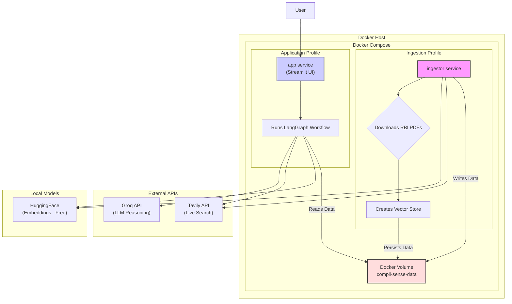
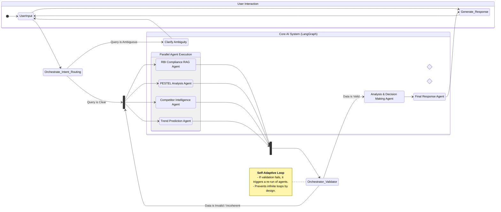

# 🤖 Compli-Sense: Agentic AI for FinTech Strategy

Compli-Sense is a cutting-edge, multi-agent AI system designed to provide comprehensive, real-time intelligence for the Indian FinTech ecosystem. It moves beyond simple Q&A to offer strategic analysis, combining RBI compliance checks, PESTEL analysis, competitor intelligence, and trend prediction into a single, conversational interface.

Built with a sophisticated LangGraph orchestration, the system is self-correcting, prompt-based, and designed for users who may not be experts in finance or law. It leverages real-time data from Tavily and powerful reasoning from Groq to deliver actionable insights.

## 🏗️ Architecture

The system is composed of two main architectural layers: a containerized deployment environment and a dynamic, multi-agent workflow.

### 1. High-Level System Architecture

This diagram illustrates the containerized deployment using Docker and Docker Compose. It highlights the separation of the data ingestion process from the application runtime, with data persistence handled by a Docker-managed volume, ensuring a clean and stateless host environment.


### 2. Multi-Agent Workflow (LangGraph)
This is the core of the application's intelligence. The workflow is a stateful graph where each node is a specialized agent. The orchestrator understands user intent, parallel agents fetch and process information, and a validator ensures quality before a final, synthesized response is generated.


## ✨ Features
- **Multi-Agent Architecture**: Leverages a team of specialized AI agents, each an expert in its domain (Compliance, PESTEL, Competition, Trends).  
- **Dynamic RAG for RBI Compliance**: Provides precise answers based on a custom-built, updatable vector database of official RBI documents.  
- **Real-Time Data Integration**: Uses Tavily to fetch the latest market news, competitor information, and economic reports, ensuring insights are never outdated.  
- **Conceptual Intent Understanding**: The orchestrator agent understands the user's goal, not just keywords, making it robust to ambiguous queries from non-experts.  
- **Self-Correcting & Reliable**: A validator agent checks the outputs from all other agents for coherence and relevance, re-running them if necessary to ensure quality.  
- **Strategic Insight Generation**: Goes beyond data retrieval to synthesize information into actionable strategic advice.  
- **Fully Containerized**: Deployed with Docker and Docker Compose for a consistent, isolated, and easy-to-manage environment.  
- **No Host Storage**: All application data is persisted within a Docker-managed volume, keeping your host machine clean.  

## 🛠️ Technologies Used
- **Backend**: Python, LangChain, LangGraph  
- **LLM**: Groq (for fast inference)  
- **Vector Store**: ChromaDB  
- **Data Source**: Tavily Search API  
- **Embeddings**: HuggingFace Sentence Transformers (free, runs locally)  
- **Frontend**: Streamlit  
- **Deployment**: Docker, Docker Compose  

## 📁 Project Structure
```markdown
CompliSense/
├── data_sources.yaml       # Configuration for RBI documents to be ingested
├── docker-compose.yml      # Defines the app and ingestor services
├── Dockerfile              # Instructions to build the Docker image
├── ingest_data.py          # Script to download documents and create the vector store
├── requirements.txt        # Python dependencies
├── .env.example            # Example environment variables file
├── src/
│   ├── agents/             # Individual agent logic
│   │   ├── analysis_agent.py
│   │   ├── competitor_agent.py
│   │   ├── orchestrator_agent.py
│   │   ├── pestel_agent.py
│   │   ├── response_agent.py
│   │   ├── rbig_agent.py
│   │   ├── trend_agent.py
│   │   └── validator_agent.py
│   └── graph/
│       ├── workflow.py     # LangGraph workflow definition
│       └── state.py        # The shared state schema for the workflow
├── ui/
│   └── app.py              # Streamlit user interface
└── utils/
    └── setup.py            # Utility functions for LLM and vector store setup
```

## 🚀 How to Run
### Prerequisites
1. **Docker**: Ensure you have Docker and Docker Compose installed on your system.  
2. **API Keys**: You will need API keys from:  
- **[Groq](https://groq.com/)** (free tier available)  
- **[Tavily](https://tavily.com/)** (free tier available)   
  
### Configuration  
1. **Clone this repository.**  

2. **Navigate to the project directory:**  
   ```bash
   cd CompliSense
   ```
3. **Create a `.env` file by copying the example:**

   ```bash
   cp .env.example .env
   ```

4. **Open the `.env` file and fill in your API keys.**

```
GROQ_API_KEY=your_groq_api_key_here
TAVILY_API_KEY=your_tavily_api_key_here
```

### Step 1: Data Ingestion
The first step is to download the RBI documents and build the knowledge base. This is a one-time setup (or whenever you want to update the data).
```bash
docker-compose --profile ingest up --build
```
This command will:
- **Build the Docker image.**  
- **Start the `ingestor` service.**  
- **Download all PDFs listed in `data_sources.yaml`.**  
- **Process them and create the Chroma vector store.**  
- **Persist all data in a Docker volume named `compli-sense-data`.**  
- **Stop the container once ingestion is complete.**

### Step 2: Run the Application
Once the data is ingested, you can start the main application.
```bash
docker-compose --profile app up
```
This command will:
- **Start the `app` service.**
- **Launch the Streamlit UI.**
- **The application will connect to the existing vector store in the Docker volume.**

Open your browser and navigate to <http://localhost:8501> to start using Compli-Sense.

### Step 3: Cleanup
To stop the application and remove all associated containers and data (useful for a full reset), run:
```bash
docker-compose down --volumes
```
   
  

