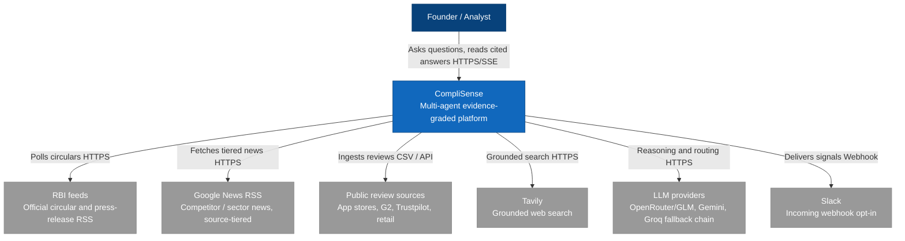
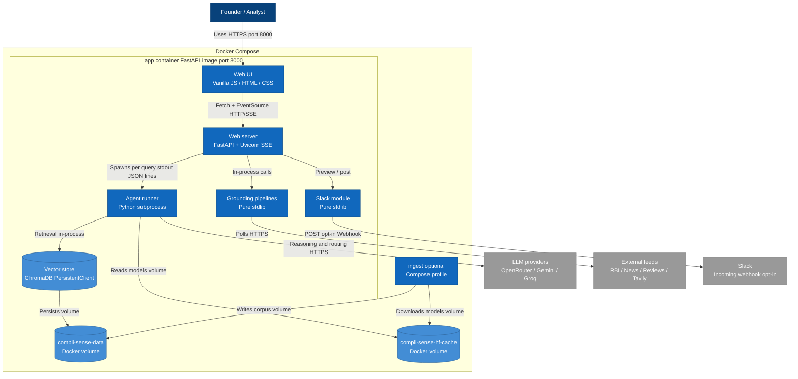
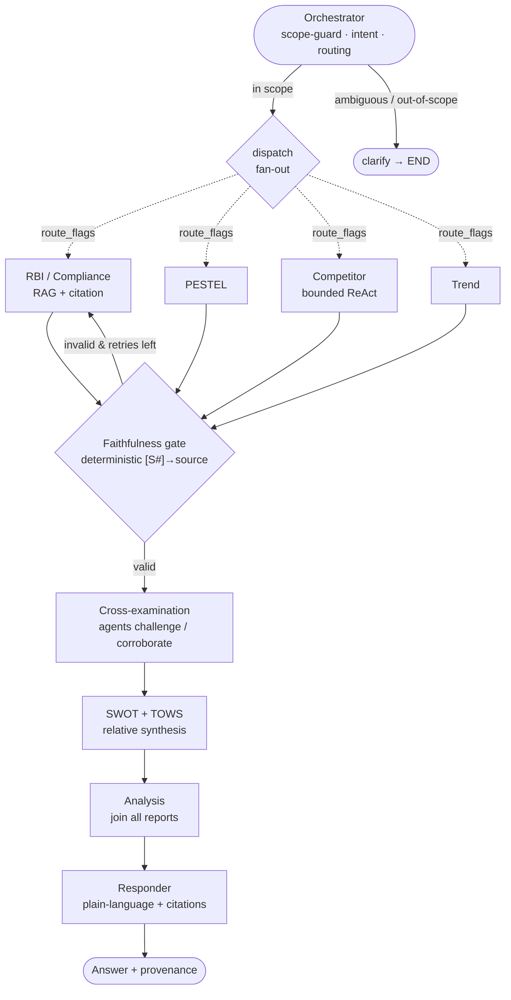
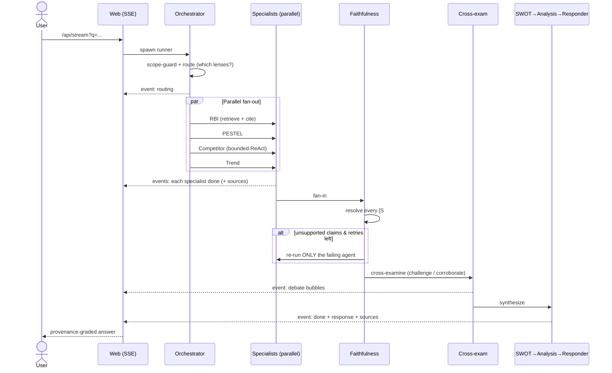

# CompliSense

**Grounded, multi-agent competitive · market · compliance intelligence — for any sector.**

CompliSense answers a business question the way a careful analyst would: it routes the question to the specialists it actually needs, runs them **in parallel**, makes them **cross-examine each other**, gates every claim through a **faithfulness check**, and returns an answer where **each sentence is graded by its evidence** — `sourced` / `estimate` / `unverified` — with a live "% grounded" score.

It is built around one conviction: *a generic chatbot will confidently make things up; a tool businesses can trust must refuse to.* Everything in the architecture below exists to make that refusal structural rather than aspirational.

> ⚠️ Informational only — not legal, financial, or regulatory advice. Verify every point against the cited primary source before acting.

---

## Table of contents
- [What it does](#what-it-does)
- [Design principles](#design-principles)
- [Architecture (C4)](#architecture-c4)
  - [Level 1 — System context](#level-1--system-context)
  - [Level 2 — Containers](#level-2--containers)
  - [Level 3 — The agent graph](#level-3--the-agent-graph-components)
  - [Dynamic view — a query's lifecycle](#dynamic-view--a-querys-lifecycle)
- [How & why the multi-agent parallelism works](#how--why-the-multi-agent-parallelism-works)
- [Trust mechanisms](#trust-mechanisms)
- [Grounding pipelines](#grounding-pipelines)
- [Tech stack](#tech-stack)
- [Run it](#run-it)
- [Security (Docker image)](#security-docker-image)
- [Repository layout](#repository-layout)
- [Implementation status & roadmap](#implementation-status--roadmap)
- [License](#license)

---


## What it does

| Capability | What it is |
|---|---|
| **Ask AI (any page, any lens)** | One question → the orchestrator routes to only the specialists it needs → a cited answer renders in place, graded by the **provenance lens**. Switch the lens — 💰 Finance · ⚖ Regulatory · ❤ Customer · ⚔ Competitor · ♟ Strategy · 📈 Growth — to reframe the whole analysis. |
| **Gap Finder** | Pick an incumbent → mine public reviews → quantify complaints **with denominators** → classify each as *fixable gap / inherent tradeoff / vocal minority* → and for the top one, a finance-gated positioning wedge. Locks to your company's sector. |
| **Watchtower** | Live RBI-circular monitoring, severity-classified, with an evidence-hashed daily brief that stays byte-identical until the underlying evidence changes. |
| **Compliance** | The regulators and obligations that apply to **your sector** (BIS/WPC for electronics, CDSCO for beauty, FSSAI for food, RBI for lending, DPDP/CERT-In for SaaS…), each linked to its primary source. |
| **Slack delivery** | Push a grounded signal (regulatory alert / competitor gap / compliance summary) into a channel as Slack Block Kit — opt-in via webhook. |

The whole product hydrates to **your company**: enter your details once, and Gap Finder, Compliance and the Ask lens all adapt to your sector.

## Design principles

1. **Sourced or flagged — never invented.** Every claim carries a resolvable citation or is explicitly marked an estimate/inference.
2. **Finance is a lens, not a cage.** Any sector, any lens; quantify when it's relevant, don't force it when it isn't.
3. **Process isolation over convenience.** The heavy ML stack never touches the web server (it segfaults under uvicorn); it runs in a subprocess.
4. **Determinism where it earns trust.** Watchtower mapping, the daily-brief evidence hash, and the citation-resolution gate are rule-based and explainable — no LLM in the trust-critical path.
5. **Degrade honestly.** Exhausted quota, thin data, or out-of-scope legs surface as estimates/flags, never as confident fabrication.

---

## Architecture (C4)

### Level 1 — System context

*Who uses CompliSense, and which external systems it depends on.*



### Level 2 — Containers

*The deployable/runtime units and how they communicate. The key architectural decision is the **process split**: the web tier is pure-stdlib and loads no ML libraries, so a single query spawns an isolated runner for the heavy stack. Under Docker Compose, that stack lives in one **app** image (port 8000 only); named volumes persist data and the HuggingFace cache; an optional **ingest** profile shares those volumes.*



**Why the split?** `torch` + `chromadb` + `sentence-transformers` under uvicorn triggered a native OpenMP segfault on the target hardware. Rather than fight it, the web server stays lightweight and each `/api/stream` request runs the ML stack in a short-lived subprocess (`agent_runner.py`), forwarding its JSON events to the browser as Server-Sent Events. This also means a crashing run can never take down the server, and the trust-critical pipelines (`watchtower`, `dailybrief`, `newsfeed`, `reviews_ingest`, `slack_integration`) are **pure stdlib** and safe to import in-process.

### Level 3 — The agent graph (components)

*Inside the agent runner: a stateful LangGraph where each node is a specialist. Solid = data flow; the orchestrator decides which specialists run.*



Each specialist writes only its own report and a shared `sources` registry (`{id, title, ref}`); reports use disjoint state keys so parallel writes never collide.

### Dynamic view — a query's lifecycle

*The sequence below shows the parallelism explicitly: the four specialists run concurrently, then converge.*



---

## How & why the multi-agent parallelism works

**The question decides the team.** The orchestrator makes a single fast-model pass that (a) guards scope, (b) writes the analysis brief, and (c) sets `route_flags` — so a narrow question ("what's my top competitor's weakness?") runs one or two agents, while a broad strategy question runs all four. You don't pay for the whole team every time.

**Parallel, not sequential — and why it's safe.** The four specialists have **no data dependency on each other**: each reads only the user brief and writes a disjoint slice of state. That makes them embarrassingly parallel. LangGraph fans out from a no-op `dispatch` node and fans back in at the faithfulness gate. The win is latency — four ~web-grounded LLM calls overlap instead of stacking — and the safety comes from the disjoint-write invariant (a merge reducer only ever unions the `sources` map).

**Then they're forced to disagree.** Parallelism alone produces four confident, possibly-contradictory reports. Two convergence stages fix that:
- **Faithfulness gate** — deterministic, no LLM: every `[S#]` marker must resolve to a real entry in the `sources` registry. If a specialist cited something it didn't retrieve, it is re-run *in isolation* (bounded retries), not the whole graph.
- **Cross-examination** — a single bounded round where agents see each other's relevant claims and emit `challenge` / `corroborate` / `flag` messages (streamed to the UI as debate bubbles). This surfaces contradictions *before* synthesis instead of laundering them into a confident summary.

**Resilience by construction.** Every node is wrapped so one specialist failing (or a provider 429) degrades that lens to a flagged gap rather than crashing the run. The LLM layer itself is a multi-level fallback chain (OpenRouter/GLM → Gemini → Groq) with a quality gate that rejects prompt-echo/garbage output and falls through.

---

## Trust mechanisms

| Mechanism | Guarantee | Where |
|---|---|---|
| **Provenance lens** | Every claim rendered `sourced` / `estimate` / `unverified` + a "% grounded" score; citations open the primary source. | `web/engine.js` (`csRenderProvenance`) |
| **Faithfulness gate** | No answer ships with a citation that doesn't resolve to a retrieved source. | `src/agents/faithfulness_agent.py` |
| **Evidence-hash stability** | The same question over the same evidence returns a byte-identical brief; it changes only when the evidence does. | `src/dailybrief.py` |
| **Retrieval refusal floor** | Below a similarity threshold, the RBI agent refuses rather than hallucinates. | `src/config.py` (`RETRIEVAL_SCORE_THRESHOLD`) |
| **Source hierarchy** | Structured/citable sources are preferred; social noise is excluded by construction. | `src/newsfeed.py`, `research/GAP_FINDER_SPEC.md` |

## Grounding pipelines

All pure-stdlib and safe to run in the web process:

- **`src/watchtower.py`** — RBI RSS → regex profile-mapping + severity rules (the productized change-monitor).
- **`src/dailybrief.py`** — evidence-hashed PESTEL/SWOT daily brief.
- **`src/newsfeed.py`** — Google News RSS per competitor/sector, **source-tiered** (regulator > press > blog/social, tier-3 excluded) + event-tagged (funding/pricing/regulatory/…).
- **`src/reviews_ingest.py`** — review → normalize → quantified themes **with denominators**; pluggable adapters (`CSVAdapter` works; retail scrapers are deliberate ToS stubs).
- **`tools/review_collector.py`** — independent, config-driven review collector → the pipeline's CSV schema.

### RAG & the research extension

The RBI/compliance lens uses hybrid retrieval — `bge-large-en-v1.5` dense + BM25, cross-encoder rerank, a refusal floor, and the deterministic citation gate. The research track (**Regulatory Memory Consolidation**: verbatim-span invariants, amendment-aware invalidation, citation-gated write-back) lives in [`research/REGULATORY_MEMORY_CONSOLIDATION.md`](research/REGULATORY_MEMORY_CONSOLIDATION.md).

## Tech stack

Python · LangGraph · FastAPI + Uvicorn (SSE) · ChromaDB · HuggingFace embeddings (local, free) · a provider-abstraction LLM layer with a multi-level fallback chain · Tavily · vanilla HTML/CSS/JS front end (GSAP, Chart.js, SVG).

## Run it

### Docker (recommended — any machine)

Prereqs: [Docker Desktop](https://www.docker.com/products/docker-desktop/) (or Docker Engine + Compose v2), and an LLM provider key in `.env`.

```bash
cp .env.example .env          # fill keys (see below)
docker compose up --build
```

| | URL |
|---|---|
| App | <http://localhost:8000> |
| Health | <http://localhost:8000/api/health> |

**`.env.example` keys** (copy to `.env`; never commit secrets):

| Key | Required? | Purpose |
|---|---|---|
| `LLM_PROVIDER` | yes | `openrouter` · `groq` · `google` · `openai` · `anthropic` · `openai_compatible` |
| `OPENROUTER_API_KEY` | if using OpenRouter | Primary LLM key (or the key for your chosen provider) |
| `TAVILY_API_KEY` | recommended | Grounded web search (PESTEL / competitor / trend) |
| `RBI_DATA_PATH` / `CHROMA_DB_PATH` | optional | Local defaults; Compose overrides to `/app/data` … |
| `HF_HOME` | optional | Embedding/reranker cache; Compose uses a named volume |
| `SLACK_*` | optional | Webhook / bot tokens — **prefer pasting in the UI** so nothing lands in git |
| `CS_AUTO_INGEST` | optional | `true` builds Chroma on first boot (slow); default `false` |

Optional RBI / compliance corpus (first time; downloads PDFs + embedding model — often 5–15+ min):

```bash
docker compose --profile ingest run --rm ingest
```

Volumes persist Chroma under `compli-sense-data` and HuggingFace models under `compli-sense-hf-cache` so restarts stay fast. Only port **8000** is published — no Chroma HTTP port.

If `http://127.0.0.1:8000/api/health` 404s while Docker is “healthy”, a local `uvicorn` is probably still bound to `127.0.0.1:8000` — stop it so Compose owns the port.

### Slack Ask AI (inbound Q&A)

Outbound alerts (Watchtower / Gap / Compliance) still use the **Incoming Webhook** (click-connect in the UI).

To **ask questions in Slack** and get agent answers back:

1. Create a Slack app at <https://api.slack.com/apps> → **From scratch**.
2. **OAuth & Permissions** → Bot Token Scopes: `chat:write`, `app_mentions:read`, `commands`, `im:history`, `im:read`, `im:write`.
3. **Install to workspace** → copy **Bot User OAuth Token** (`xoxb-…`).
4. **Basic Information** → App-Level Tokens → create token with `connections:write` (`xapp-…`).
5. **Socket Mode** → Enable (best for local Docker — no public URL / ngrok).
6. Optional: add slash command `/complisense` (Socket Mode does not need a Request URL).
7. In CompliSense UI: **Slack → Tokens & webhook** → paste Bot Token + App Token → **Enable Ask AI in Slack**.
8. In Slack: `@YourBot what is my top competitor weakness?` or DM the bot — answer arrives in-thread (~30–90s).

HTTP alternative (public URL): point Event Subscriptions to `https://YOUR_HOST/api/slack/events` and Slash Request URL to `…/api/slack/commands`, and paste the Signing Secret in the same UI.

### Local (without Docker)

Prereqs: Python 3.11+, keys in `.env`.

```bash
pip install -r requirements.txt
python ingest_data.py                                   # one-time: build the RBI vector store
uvicorn server:app --host 127.0.0.1 --port 8000
```

Open <http://127.0.0.1:8000>.

## Security (Docker image)

Hardening as of **2026-07-15** (see `Dockerfile` comments for the same notes):

| Hardened | Detail |
|---|---|
| Multi-stage image | Builder has `build-essential`; runtime is slim Bookworm + `libgomp1` only |
| OS updates | `apt-get upgrade` on builder and runtime |
| PyPI patches | `setuptools>=83`, `wheel>=0.46.2`, `jaraco.context>=6.1.0` (CVE-2026-59890, CVE-2026-24049, CVE-2026-23949) |
| No `curl` in runtime | Healthcheck uses Python stdlib `urllib` |
| Chroma local-only | `PersistentClient` in-process — **no** Chroma HTTP/FastAPI server, **no** Chroma port published |
| Secrets | Slack tokens via UI (or `.env` locally); **do not commit** `.env` or tokens |
| Ports | Publish only `8000`; do not expose unnecessary services |

**Residual risk**

- **chromadb CVE-2026-45829** (ChromaToast): no fixed PyPI release past **1.5.9** yet. CompliSense never runs `chroma run` / the collection HTTP API — the documented attack surface for that CVE — so risk is mitigated by architecture until upstream `>1.5.9`.
- **Debian base**: scanner hits on Bookworm packages (perl/tar/glibc family and similar) may remain unfixed or disputed upstream; keep the base image updated and avoid shipping extra OS tools.
- Treat API keys and Slack tokens as secrets; rotate if they ever land in git history.

## Repository layout

```
server.py                 FastAPI web server (SSE) + static UI + pure-stdlib APIs
agent_runner.py           isolated LangGraph runner (markdown / --json)
src/
  agents/                 orchestrator · rbi · pestel · competitor · trend ·
                          faithfulness · crossexam · swot · analysis · responder
  graph/workflow.py       LangGraph wiring (parallel fan-out, retry, cross-exam)
  llm/                    provider abstraction + fallback chain + structured calls
  watchtower.py  dailybrief.py  newsfeed.py  reviews_ingest.py  slack_integration.py
  memory/rmc.py           Regulatory Memory Consolidation (research)
tools/review_collector.py independent review collector → CSV
web/                      UI (index, agents, gapfinder, watchtower, compliance, pestel, swot, trends, competitors)
research/                 RMC design + Gap Finder spec
evals/                    NormBench + RMC evaluation harness
```

## Implementation status & roadmap

*Honest state, so you can evaluate the repo fairly.*

**Working & verified**
- Multi-agent workflow with dynamic routing, faithfulness gate, cross-examination.
- Provenance lens across pages; inline Ask panel with 6 switchable lenses.
- Company onboarding → sector hydration (Gap Finder + Compliance lock to the company's sector).
- Gap Finder (5 grounded sector showcases) with zoom-into-the-gap interaction.
- Watchtower + evidence-hashed daily brief. News, review-ingest and collector pipelines (verified end-to-end).
- Slack Block Kit delivery (preview without a workspace; opt-in webhook post).

**In progress**
- Full visual redesign / motion system across all deep pages (Compliance is the first re-laid-out page).
- Per-company **generated** PESTEL/SWOT content (today PESTEL/SWOT show curated demo data; company-specific generation is the next lift and depends on live model quota).
- Agent-level claim tagging (moving `FACT/INFERENCE/ESTIMATE` from a render-time heuristic into agent output).
- RMC research → publishable paper (design + pilot results done; benchmark scale-up and a real compression baseline remain — see the research doc's honest self-assessment).

## License

MIT. Use it, fork it, ship it.
